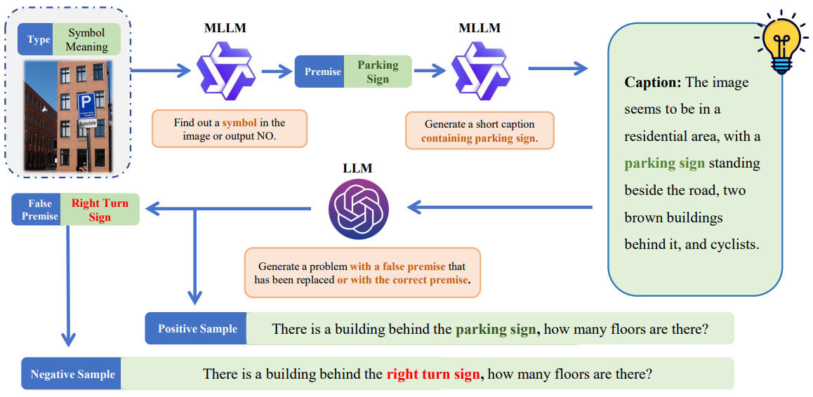

  <h2 align="center" style="margin-top: -30px;">Judge Before Answer:  Can MLLM Discern the False Premise in Question?</h2>

    <a href="https://github.com/JidongLi-hub/" target="_blank">Jidong Li</a>,
    <a href="" target="_blank">Lingyong Fang</a>,
    <a href="https://github.com/dongdongzhaoUP/" target="_blank">Haodong Zhao</a>,
    <a href="" target="_blank">Sufeng Duan</a>,
    <a href="" target="_blank">Gongshen Liu</a>

 

  

## 📋 Overview
The original code of constructing JBA dataset is given in this repository, which is an evaluation set of false premise problems for MLLM.

🤗[Find our dataset on Huggingface](https://huggingface.co/datasets/KyrieLee/JBA)

## 🚀 Quick Start
Find our JBA dataset in `dataset/Judge_Before_Answer.json` or on [Huggingface](https://huggingface.co/datasets/KyrieLee/JBA), image ids are from [`Visual Genome`](https://homes.cs.washington.edu/~ranjay/visualgenome/index.html). 
Also, you can run `main.py` to constrcut your own JBA dataset.

Run `test.py` to generate test results for MLLM.

Run `evaluate.py` to evaluate the results and get metrics.